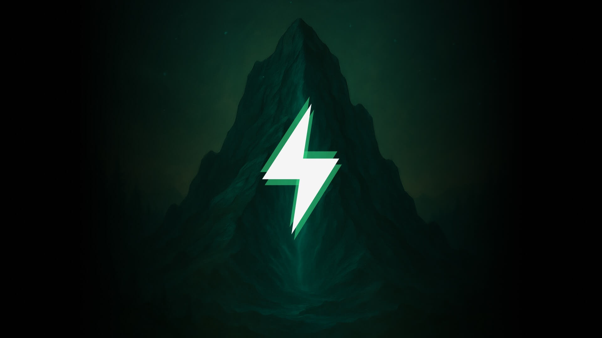

<div align="center">
  

  # Arctic Howl — OffSec Challenge Solutions 🐺❄️
  ### Tundra Realm · Season 2 · Proving Grounds: The Gauntlet

  
  
  
</div>

---

## 📖 About Arctic Howl

> *"The Cascade Expanse is no longer ruled by instinct alone. Ashka, an Arctic Wolf, was among the greatest cybersecurity hunters the Expanse had ever known – defending the Tundra Realm through instinct, reading subtle signals, sensing danger, and striking before threats could surface. When unusual activity rippled through the Tundra data center, Ashka moved to investigate but the adversary was already there. Two steps ahead. From the shadows, Ashka was struck down and taken. When the alarms faded, she was gone."*

Arctic Howl is a high-stakes cyber defense simulation featuring escalating weekly scenarios set in a frozen cybersecurity battleground. Throughout this Gauntlet season, challengers face an evolving adversary, uncovering the truth behind a missing guardian, a calculating adversary, and a chilling experiment that seeks to reshape instinct itself — blurring the line between hunter and machine.

**Only those who adapt will survive. Only those who endure will uncover the truth. And only the strongest will reach the heart of the storm.**

---

## 📂 Challenge Solutions

---

### ✅ [Week 0 — Tutorial Challenge](./WEEK%200%20-%20Tutorial%20Challenge)


**Status:** COMPLETED &nbsp;|&nbsp; **Category:** Log Analysis · Encoding · Web Forensics &nbsp;|&nbsp; **Difficulty:** Beginner &nbsp;|&nbsp; **Score:** 50/50

**Scenario:** Analyze a web server to extract a hidden flag from a Base64-encoded file, then investigate Apache access logs to identify an attacker who exploited a path traversal vulnerability to steal SSH private keys.

**Key Skills:**
- Base64 encoding/decoding
- Web server log analysis
- Path traversal vulnerability detection
- Security incident investigation

**Key Findings:**
- ✅ Decoded Base64 flag: `TryHarder`
- ✅ Identified attacker IP: `192.168.1.101`
- ✅ Attack vector: Path Traversal via `/public/plugins/welcome/../../../../../../../../home/dave/.ssh/id_rsa`
- ✅ Data stolen: SSH private key (`id_rsa`) — 1,678 bytes, HTTP 200 OK

**Files:**
- [Investigation Report](./WEEK%200%20-%20Tutorial%20Challenge/INVESTIGATION_REPORT.md)
- [Challenge README](./WEEK%200%20-%20Tutorial%20Challenge/README.md)

---

### ✅ [Week 1 — First Tracks](./WEEK%201%20-%20First%20Tracks)


**Status:** COMPLETED &nbsp;|&nbsp; **Category:** Malware Analysis · PCAP Forensics · IR &nbsp;|&nbsp; **Difficulty:** Easy &nbsp;|&nbsp; **Score:** 40/40

**Scenario:** At the Cascade Law Archive, a cold spike in outbound traffic appeared after a new developer cloned a starter Xcode project. PCAP analysis reveals a sophisticated Mac malware campaign: trojanized Xcode project → triple hex dropper → multi-stage C2 payloads → Apple Notes/Reminders theft → Git hook propagation.

**Key Skills:**
- PCAP analysis (Wireshark / tshark)
- Multi-layer encoding reversal (triple hex + 7× Base64)
- AppleScript malware analysis
- Git hook injection and supply chain attack investigation
- YARA / Sigma / Snort detection rule authoring

**Key Findings:**
- ✅ Initial dropper: `xcassets.sh` with triple hex encoding
- ✅ C2 domain: `bu1knames.io` (7 payload modules delivered)
- ✅ User-agent pivot: Safari → `curl/8.7.1` (indicator of compromise)
- ✅ Data exfiltrated: Apple Notes + Reminders + hardware serial number
- ✅ Propagation: `jez` injects malicious `pre-commit` hooks into all local Git repos
- ✅ All 6 challenge questions answered correctly

**Novel Techniques Discovered:**
- Triple hex encoding for static analysis evasion
- 7-layer nested Base64 in AppleScript payloads
- Git pre-commit hook worm for developer-targeted propagation
- System profiling via `looz` before full payload deployment

**Files:**
- [Investigation Report](./WEEK%201%20-%20First%20Tracks/INVESTIGATION_REPORT.md)
- [Challenge README](./WEEK%201%20-%20First%20Tracks/README.md)

---

### 🔒 [Week 2 — Expanse Surveyor](./WEEK%202%20-%20Expanse%20Surveyor) *(Coming Soon)*


**Status:** UPCOMING &nbsp;|&nbsp; **Difficulty:** Medium

*A deeper investigation into the Tundra Realm reveals new threats lurking beneath the frozen surface.*

---

### 🔒 [Week 3 — Cold Access](./WEEK%203%20-%20Cold%20Access) *(Coming Soon)*


**Status:** UPCOMING &nbsp;|&nbsp; **Difficulty:** Hard

*The adversary strengthens their foothold. Advanced techniques required to breach the frozen perimeter.*

---

### 🔒 [Week 4 — Trusted Trouble](./WEEK%204%20-%20Trusted%20Trouble) *(Coming Soon)*



**Status:** LOCKED &nbsp;|&nbsp; **Difficulty:** Expert

*The final confrontation. Uncover the truth behind the calculating adversary.*

---

## 📊 Progress Tracker

| Week | Challenge | Status | Category | Difficulty | Score |
|------|-----------|--------|----------|------------|-------|
| 0 | Tutorial Challenge | ✅ Completed | Log Analysis / Encoding | Beginner | 50/50 |
| 1 | First Tracks | ✅ Completed | Malware Analysis / PCAP / IR | Easy | 40/40 |
| 2 | Expanse Surveyor | 🔒 Upcoming | TBA | Medium | — |
| 3 | Cold Access | 🔒 Upcoming | TBA | Hard | — |
| 4 | Trusted Trouble | 🔒 Locked | TBA | Expert | — |

---

## 🎯 Learning Objectives

Through these challenges, I'm developing expertise in:

- **Incident Response:** Systematic investigation methodologies
- **Digital Forensics:** Evidence collection and analysis
- **Malware Analysis:** Threat detection and multi-stage campaign reconstruction
- **PCAP Analysis:** Network traffic investigation and C2 identification
- **Mac Security:** macOS artifact locations, AppleScript abuse, Xcode project threats
- **Log Analysis:** Web server log parsing and attack pattern detection
- **Encoding/Decoding:** Base64, hex encoding schemes and nested obfuscation
- **Web Security:** Path traversal and directory traversal attacks
- **Supply Chain Security:** Git hook injection and trojanized project detection
- **Detection Engineering:** YARA rules, Sigma rules, Snort rules
- **Python Automation:** Security tooling and scripting

---

## 🛠️ Tools & Technologies

- **Network Analysis:** Wireshark, tshark, Scapy
- **Scripting:** Python 3, Bash, PowerShell
- **Encoding/Decoding:** base64, xxd, Python
- **Forensics:** Log analysis, artifact recovery, PCAP analysis
- **Detection:** YARA rules, Sigma rules, Snort rules, MITRE ATT&CK
- **Web Security:** OWASP practices, access log analysis
- **Mac Security:** AppleScript analysis, macOS artifact investigation

---

## 🏆 Achievements

- ✅ Week 0: Identified path traversal attack and SSH key exfiltration from access logs
- ✅ Week 1: Reconstructed full multi-stage Mac malware campaign from PCAP — 6/6 questions
- ✅ Discovered novel techniques: triple hex encoding, 7× nested Base64, Git hook worm
- ✅ Documented complete C2 infrastructure with all endpoints mapped
- ✅ Created comprehensive detection rules (YARA, Sigma, Snort) for identified malware
- ✅ Total score: 90/90 across completed challenges

---

## 📝 Repository Structure

```
arctic-howl-offsec-season2/
├── README.md                              # This file
├── assets/                                # Challenge thumbnail images
│   ├── arctic-howl-logo.png
│   ├── tutorial.jpg
│   ├── first-tracks.jpg
│   ├── expanse-surveyor.jpg
│   ├── cold-access.jpg
│   └── default.jpg
├── WEEK 0 - Tutorial Challenge/
│   ├── README.md                          # Challenge overview
│   └── INVESTIGATION_REPORT.md           # Full forensic analysis
└── WEEK 1 - First Tracks/
    ├── README.md                          # Challenge overview
    └── INVESTIGATION_REPORT.md           # Full forensic analysis (6/6 questions)
```

---

## 🚀 Quick Start

```bash
# Clone this repository
git clone https://github.com/umair-aziz025/arctic-howl-offsec-season2.git
cd arctic-howl-offsec-season2

# Navigate to a specific week
cd "WEEK 0 - Tutorial Challenge"
# or
cd "WEEK 1 - First Tracks"

# Read the challenge writeup
# Check README.md for challenge overview
# Review INVESTIGATION_REPORT.md for detailed analysis
```

---

## 📚 Learning Resources

- [OffSec Proving Grounds](https://www.offsec.com/)
- [MITRE ATT&CK](https://attack.mitre.org/)
- [OWASP Top 10](https://owasp.org/www-project-top-ten/)
- [Wireshark User Guide](https://www.wireshark.org/docs/wsug_html_chunked/)
- [PCAP Analysis Techniques](https://www.malware-traffic-analysis.net/)
- [SANS Internet Storm Center](https://isc.sans.edu/)
- [Apple Developer Docs: Xcode Build Phases](https://developer.apple.com/documentation/xcode)
- [NIST Cybersecurity Framework](https://www.nist.gov/cyberframework)
- [CISA Cybersecurity Advisories](https://www.cisa.gov/news-events/cybersecurity-advisories)

---

## 🤝 Connect

**Umair Aziz**

- GitHub: [@umair-aziz025](https://github.com/umair-aziz025)
- Repository: [arctic-howl-offsec-season2](https://github.com/umair-aziz025/arctic-howl-offsec-season2)
- Season 1: [echo-response-offsec-challenge](https://github.com/umair-aziz025/echo-response-offsec-challenge)

---

## 📄 License

This repository is for educational purposes only. Challenge scenarios are property of OffSec. Solution writeups are my own work.

---

## ⭐ Star This Repo

If you find these solutions helpful, please consider giving this repository a star!

---

*Last Updated: March 5, 2026*

> *"Will you uncover the truth before the storm consumes the Expanse?"*
