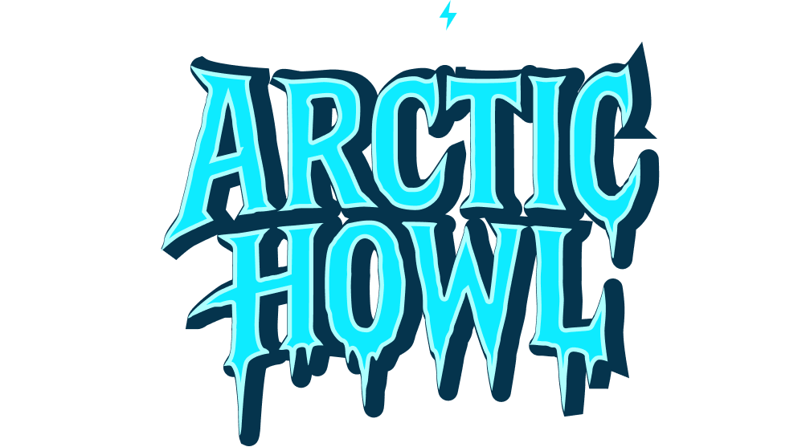
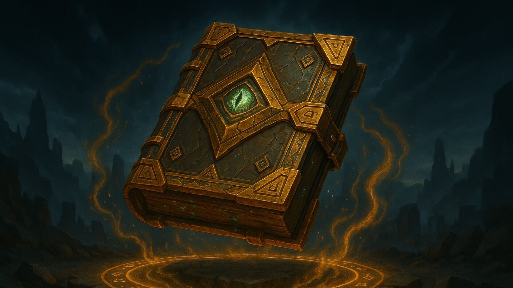

<div align="center">
  

  # Arctic Howl — OffSec Challenge Solutions 🐺❄️
  ### Tundra Realm · Season 2 · Proving Grounds: The Gauntlet

  
  
  
</div>

---

## 📖 About Arctic Howl

> *"The Cascade Expanse is no longer ruled by instinct alone. Ashka, an Arctic Wolf, was among the greatest cybersecurity hunters the Expanse had ever known – defending the Tundra Realm through instinct, reading subtle signals, sensing danger, and striking before threats could surface. When unusual activity rippled through the Tundra data center, Ashka moved to investigate but the adversary was already there. Two steps ahead. From the shadows, Ashka was struck down and taken. When the alarms faded, she was gone."*

Arctic Howl is a high-stakes cyber defense simulation featuring escalating weekly scenarios set in a frozen cybersecurity battleground. Throughout this Gauntlet season, challengers face an evolving adversary, uncovering the truth behind a missing guardian, a calculating adversary, and a chilling experiment that seeks to reshape instinct itself — blurring the line between hunter and machine.

**Only those who adapt will survive. Only those who endure will uncover the truth. And only the strongest will reach the heart of the storm.**

---

## 📂 Challenge Solutions

---

### ✅ [Week 0 — Tutorial Challenge](./WEEK%200%20-%20Tutorial%20Challenge)



**Status:** COMPLETED &nbsp;|&nbsp; **Category:** Log Analysis · Encoding · Web Forensics &nbsp;|&nbsp; **Difficulty:** Beginner &nbsp;|&nbsp; **Score:** 50/50

**Scenario:** Analyze a web server to extract a hidden flag from a Base64-encoded file, then investigate Apache access logs to identify an attacker who exploited a path traversal vulnerability to steal SSH private keys.

**Key Skills:**
- Base64 encoding/decoding
- Web server log analysis
- Path traversal vulnerability detection
- Security incident investigation

**Key Findings:**
- ✅ Decoded Base64 flag: `TryHarder`
- ✅ Identified attacker IP: `192.168.1.101`
- ✅ Attack vector: Path Traversal via `/public/plugins/welcome/../../../../../../../../home/dave/.ssh/id_rsa`
- ✅ Data stolen: SSH private key (`id_rsa`) — 1,678 bytes, HTTP 200 OK

**Files:**
- [Investigation Report](./WEEK%200%20-%20Tutorial%20Challenge/INVESTIGATION_REPORT.md)
- [Challenge README](./WEEK%200%20-%20Tutorial%20Challenge/README.md)

---

### ✅ [Week 1 — First Tracks](./WEEK%201%20-%20First%20Tracks)


**Status:** COMPLETED &nbsp;|&nbsp; **Category:** Malware Analysis · PCAP Forensics · IR &nbsp;|&nbsp; **Difficulty:** Easy &nbsp;|&nbsp; **Score:** 40/40

**Scenario:** At the Cascade Law Archive, a cold spike in outbound traffic appeared after a new developer cloned a starter Xcode project. PCAP analysis reveals a sophisticated Mac malware campaign: trojanized Xcode project → triple hex dropper → multi-stage C2 payloads → Apple Notes/Reminders theft → Git hook propagation.

**Key Skills:**
- PCAP analysis (Wireshark / tshark)
- Multi-layer encoding reversal (triple hex + 7× Base64)
- AppleScript malware analysis
- Git hook injection and supply chain attack investigation
- YARA / Sigma / Snort detection rule authoring

**Key Findings:**
- ✅ Initial dropper: `xcassets.sh` with triple hex encoding
- ✅ C2 domain: `bu1knames.io` (7 payload modules delivered)
- ✅ User-agent pivot: Safari → `curl/8.7.1` (indicator of compromise)
- ✅ Data exfiltrated: Apple Notes + Reminders + hardware serial number
- ✅ Propagation: `jez` injects malicious `pre-commit` hooks into all local Git repos
- ✅ All 6 challenge questions answered correctly

**Novel Techniques Discovered:**
- Triple hex encoding for static analysis evasion
- 7-layer nested Base64 in AppleScript payloads
- Git pre-commit hook worm for developer-targeted propagation
- System profiling via `looz` before full payload deployment

**Files:**
- [Investigation Report](./WEEK%201%20-%20First%20Tracks/INVESTIGATION_REPORT.md)
- [Challenge README](./WEEK%201%20-%20First%20Tracks/README.md)

---

### ✅ [Week 2 — Expanse Surveyor](./WEEK%202%20-%20Expanse%20Surveyor)


**Status:** COMPLETED &nbsp;|&nbsp; **Category:** Android Malware Analysis · HAR Forensics · APK Reverse Engineering &nbsp;|&nbsp; **Difficulty:** Medium &nbsp;|&nbsp; **Score:** 70/70

**Scenario:** An Expanse Surveyor installed a Research Gallery app (Fossify Gallery) on his Android device to organize expedition findings. Within 48 hours, anomalous outbound connections surfaced. Analysis of the trojanized APK and HAR network capture reveals a sophisticated Android malware campaign: GitHub Gist C2 resolution → 15x Base64 + XOR decryption → dynamic DEX payload loading → file reconnaissance → photo/video exfiltration → passive GPS tracking.

**Key Skills:**
- Android APK decompilation (JADX)
- HAR file traffic analysis
- Protobuf binary decoding
- Multi-layer Base64 + XOR decryption
- DEX payload extraction and in-memory execution analysis
- Android permission model and PASSIVE_PROVIDER GPS strategy

**Key Findings:**
- ✅ C2 resolution: GitHub Gist → 15x Base64 → XOR "blastoise" → `446d9f29543f.ngrok-free.app`
- ✅ Dynamic payload delivery via PayloadResponse protobuf + InMemoryDexClassLoader
- ✅ 3 DEX modules: FileScanner (recon), MetaDataParser (file theft), LocationTracker (GPS)
- ✅ Files exfiltrated: JPEG photo (Sony XQ-BC62) + MP4 video to `/api/backup/chunk`
- ✅ GPS anomaly: 12/15 geotag requests fail due to missing ACCESS_BACKGROUND_LOCATION
- ✅ Success window (20:45:20-20:46:20Z) correlates with YouTube activating GPS via PASSIVE_PROVIDER
- ✅ All 7 challenge questions answered correctly

**Novel Techniques Discovered:**
- 15-layer Base64 + XOR encryption for C2 address obfuscation
- In-memory DEX execution via InMemoryDexClassLoader (no disk artifacts)
- PASSIVE_PROVIDER GPS piggyback strategy to avoid background location permission
- Server-driven payload architecture where C2 controls all module execution

**Files:**
- [Investigation Report](./WEEK%202%20-%20Expanse%20Surveyor/INVESTIGATION_REPORT.md)
- [Challenge README](./WEEK%202%20-%20Expanse%20Surveyor/README.md)

---

### ✅ [Week 3 — Cold Access](./WEEK%203%20-%20Cold%20Access)


**Status:** COMPLETED &nbsp;|&nbsp; **Category:** Browser Exploit Analysis / PCAP Forensics / Shellcode RE &nbsp;|&nbsp; **Difficulty:** Hard &nbsp;|&nbsp; **Score:** 10/10

**Scenario:** A suspicious browser-based initial access event was traced to phishing-delivered email lure activity. Analysis of PCAP artifacts revealed a V8 type confusion exploit chain (DOMRect/AudioBuffer), WebAssembly-assisted JIT spraying, import dispatch table hijacking, and in-memory shellcode execution calling WinExec with an embedded `ping db` command.

**Key Skills:**
- POP3 + HTTP forensic timeline reconstruction
- Browser exploit extraction from PCAP
- WebAssembly payload triage and shellcode reconstruction
- x64 disassembly and calling convention analysis
- Evidence-based challenge answer validation

**Key Findings:**
- ✅ Initial vector: phishing email via POP3 leading to malicious HTTP page
- ✅ Exploit success notification via ICMP
- ✅ CVE mapped to `CVE-2024-5830`
- ✅ Enabling instruction: `mov byte ptr [rcx + 8], 0`
- ✅ Final command confirmed from payload bytes: `ping db`
- ✅ All 10 challenge questions answered correctly

**Files:**
- [Investigation Report](./WEEK%203%20-%20Cold%20Access/INVESTIGATION_REPORT.md)
- [Challenge README](./WEEK%203%20-%20Cold%20Access/README.md)

---

### ✅ [Week 4 — Cold Access](./WEEK%204%20-%20Cold%20Access)


**Status:** COMPLETED &nbsp;|&nbsp; **Category:** Insider Threat / PCAP Forensics / Data Exfil Analysis &nbsp;|&nbsp; **Difficulty:** Hard &nbsp;|&nbsp; **Score:** 8/8

**Scenario:** Megacorp One observed post-onboarding insider behavior across MAIL and CLIENT systems. Correlating SMTP workflows with suspicious CLIENT10 upload sessions revealed staged exfiltration and recovered encrypted sensitive data.

**Key Findings:**
- ✅ Applicants: `9`, accepted: `fernanda.ribeiro, samuel.adu, min-jun.park`
- ✅ Exfil public IP: `203.98.112.47`
- ✅ Exfil content recovered from disguised upload chain: encrypted `note3` archive -> `sensitive.db`
- ✅ Sensitive credential confirmed: `Robin Schwartz / 5up3r5Tr0NgP@$$w0rd!`
- ✅ Insider identified: `samuel.adu`

**Files:**
- [Investigation Report](./WEEK%204%20-%20Cold%20Access/INVESTIGATION_REPORT.md)
- [Challenge README](./WEEK%204%20-%20Cold%20Access/README.md)

---

## 📊 Progress Tracker

| Week | Challenge | Status | Category | Difficulty | Score |
|------|-----------|--------|----------|------------|-------|
| 0 | Tutorial Challenge | ✅ Completed | Log Analysis / Encoding | Beginner | 50/50 |
| 1 | First Tracks | ✅ Completed | Malware Analysis / PCAP / IR | Easy | 40/40 |
| 2 | Expanse Surveyor | ✅ Completed | Android Malware / HAR / APK RE | Medium | 70/70 |
| 3 | Cold Access | ✅ Completed | Browser Exploit / PCAP / Shellcode RE | Hard | 10/10 |
| 4 | Cold Access | ✅ Completed | Insider Threat / PCAP / Exfil Analysis | Hard | 8/8 |

---

## 🎯 Learning Objectives

Through these challenges, I'm developing expertise in:

- **Incident Response:** Systematic investigation methodologies
- **Digital Forensics:** Evidence collection and analysis
- **Malware Analysis:** Threat detection and multi-stage campaign reconstruction
- **PCAP Analysis:** Network traffic investigation and C2 identification
- **Mac Security:** macOS artifact locations, AppleScript abuse, Xcode project threats
- **Android Security:** APK reverse engineering, DEX analysis, Android permission model
- **Log Analysis:** Web server log parsing and attack pattern detection
- **Encoding/Decoding:** Base64, hex encoding schemes, nested obfuscation, XOR encryption
- **Web Security:** Path traversal and directory traversal attacks
- **Supply Chain Security:** Git hook injection, trojanized project/app detection
- **Protocol Analysis:** Protobuf binary decoding, HAR traffic forensics
- **Detection Engineering:** YARA rules, Sigma rules, Snort rules
- **Python Automation:** Security tooling and scripting

---

## 🛠️ Tools & Technologies

- **Network Analysis:** Wireshark, tshark, Scapy
- **Scripting:** Python 3, Bash, PowerShell
- **Encoding/Decoding:** base64, xxd, Python
- **Forensics:** Log analysis, artifact recovery, PCAP analysis, HAR forensics
- **Android RE:** JADX, DEX analysis, InMemoryDexClassLoader, Protobuf decoding
- **Browser Exploit RE:** WebAssembly triage, JIT spraying analysis, x64 shellcode disassembly
- **Detection:** YARA rules, Sigma rules, Snort rules, MITRE ATT&CK
- **Web Security:** OWASP practices, access log analysis
- **Mac Security:** AppleScript analysis, macOS artifact investigation
- **Mobile Security:** Android permission analysis, GPS provider exploitation

---

## 🏆 Achievements

- ✅ Week 0: Identified path traversal attack and SSH key exfiltration from access logs
- ✅ Week 1: Reconstructed full multi-stage Mac malware campaign from PCAP — 6/6 questions
- ✅ Week 2: Reverse-engineered trojanized Android APK with dynamic DEX payloads — 7/7 questions
- ✅ Week 3: Reconstructed V8 exploit chain from PCAP and validated in-memory command execution — 10/10 questions
- ✅ Week 4: Reconstructed insider exfil chain from MAIL + CLIENT captures and recovered stolen DB credentials — 8/8 questions
- ✅ Discovered novel techniques: triple hex encoding, 7× nested Base64, Git hook worm
- ✅ Discovered novel techniques: 15× Base64 + XOR C2 obfuscation, PASSIVE_PROVIDER GPS piggyback
- ✅ Discovered novel techniques: DOMRect/AudioBuffer confusion, TrustedCage dispatch pivot, JIT shellcode command extraction
- ✅ Documented complete C2 infrastructure with all endpoints mapped
- ✅ Created comprehensive detection rules (YARA, Sigma, Snort) for identified malware

---

## 📝 Repository Structure

```
arctic-howl-offsec-season2/
├── README.md                              # This file
├── assets/                                # Challenge thumbnail images
│   ├── arctic-howl-logo.png
│   ├── tutorial.jpg
│   ├── first-tracks.jpg
│   ├── expanse-surveyor.jpg
│   ├── cold-access.jpg
│   └── default.jpg
├── WEEK 0 - Tutorial Challenge/
│   ├── README.md                          # Challenge overview
│   └── INVESTIGATION_REPORT.md           # Full forensic analysis
├── WEEK 1 - First Tracks/
│   ├── README.md                          # Challenge overview
│   └── INVESTIGATION_REPORT.md           # Full forensic analysis (6/6 questions)
├── WEEK 2 - Expanse Surveyor/
│   ├── README.md                          # Challenge overview
│   └── INVESTIGATION_REPORT.md           # Full forensic analysis (7/7 questions)
├── WEEK 3 - Cold Access/
│   ├── README.md                          # Challenge overview
│   └── INVESTIGATION_REPORT.md           # Full forensic analysis (10/10 questions)
└── WEEK 4 - Cold Access/
  ├── README.md                          # Challenge overview
  └── INVESTIGATION_REPORT.md           # Full forensic analysis (8/8 questions)
```

---

## 🚀 Quick Start

```bash
# Clone this repository
git clone https://github.com/umair-aziz025/arctic-howl-offsec-season2.git
cd arctic-howl-offsec-season2

# Navigate to a specific week
cd "WEEK 0 - Tutorial Challenge"
# or
cd "WEEK 1 - First Tracks"
# or
cd "WEEK 2 - Expanse Surveyor"

# Read the challenge writeup
# Check README.md for challenge overview
# Review INVESTIGATION_REPORT.md for detailed analysis
```

---

## 📚 Learning Resources

- [OffSec Platform](https://www.offsec.com/) (Official platform for Proving Grounds and challenge practice)
- [OffSec Proving Grounds](https://www.offsec.com/labs/) (Hands-on offensive security labs)
- [MITRE ATT&CK](https://attack.mitre.org/) (Technique mapping for malware and intrusion behavior)
- [OWASP Top 10](https://owasp.org/www-project-top-ten/) (Web risk baseline used in Week 0)
- [OWASP Web Security Testing Guide (WSTG)](https://owasp.org/www-project-web-security-testing-guide/)
- [PortSwigger Path Traversal Guide](https://portswigger.net/web-security/file-path-traversal)
- [Wireshark User Guide](https://www.wireshark.org/docs/wsug_html_chunked/)
- [tshark Documentation](https://www.wireshark.org/docs/man-pages/tshark.html)
- [Malware Traffic Analysis](https://www.malware-traffic-analysis.net/) (PCAP workflow and traffic analysis practice)
- [Apple Developer Documentation](https://developer.apple.com/documentation/) (Mac/Xcode context from Week 1)
- [Git Hooks Documentation](https://git-scm.com/docs/githooks) (Relevant for pre-commit hook abuse analysis)
- [Android Developers: App Manifest Overview](https://developer.android.com/guide/topics/manifest/manifest-intro)
- [Android Developers: Request App Permissions](https://developer.android.com/training/permissions/requesting)
- [Android Developers: Location Permissions](https://developer.android.com/develop/sensors-and-location/location/permissions)
- [OWASP Mobile Application Security Testing Guide (MASTG)](https://mas.owasp.org/MASTG/)
- [JADX GitHub Repository](https://github.com/skylot/jadx)
- [Protocol Buffers Developer Guide](https://protobuf.dev/programming-guides/proto3/)
- [Chrome DevTools Network Reference](https://developer.chrome.com/docs/devtools/network/reference/) (HAR/network inspection)
- [NIST Cybersecurity Framework](https://www.nist.gov/cyberframework)
- [CISA Cybersecurity Advisories](https://www.cisa.gov/news-events/cybersecurity-advisories)

---

## 🤝 Connect

**Umair Aziz**

- GitHub: [@umair-aziz025](https://github.com/umair-aziz025)
- Repository: [arctic-howl-offsec-season2](https://github.com/umair-aziz025/arctic-howl-offsec-season2)
- Season 1: [echo-response-offsec-challenge](https://github.com/umair-aziz025/echo-response-offsec-challenge)

---

## 📄 License

This repository is for educational purposes only. Challenge scenarios are property of OffSec. Solution writeups are my own work.

---

## ⭐ Star This Repo

If you find these solutions helpful, please consider giving this repository a star!

---

*Last Updated: March 25, 2026*

> *"Will you uncover the truth before the storm consumes the Expanse?"*
