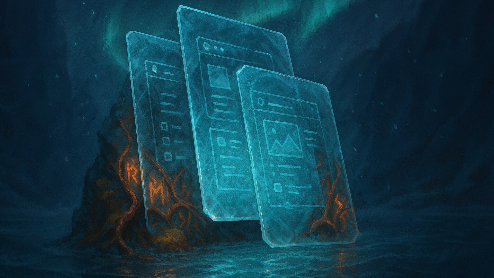

<div align="center">
  

  # WEEK 2 -- Expanse Surveyor
  ### OffSec Arctic Howl - Tundra Realm - Season 2
</div>

---

## Challenge Overview

| Field | Details |
|-------|---------|
| **Status** | COMPLETED |
| **Category** | Android Malware Analysis - HAR Forensics - APK Reverse Engineering |
| **Difficulty** | Medium |
| **Event** | Arctic Howl: The Cascade Expanse -- Season 2 |
| **Score** | 7 / 7 |

---

## Scenario

Returning from a foreign realm, an Expanse Surveyor crossed back into the Cascade Expanse carrying new field notes, environmental observations, and images of systems never before cataloged. Initial debriefs showed nothing out of the ordinary. The data appeared clean.

At home, the Surveyor installed the Research Gallery application on his Android to organize and review the findings. The app was used to offload photos and annotations captured during the expedition -- seemingly harmless fragments of discovery.

Within 48 hours of reconnecting to their home network, anomalies surfaced. Outbound connections appeared where none should exist. Obfuscated traffic pulsed at irregular intervals, synchronized with no known service. The home network security system flagged the activity and escalated the alert. The device was immediately quarantined.

**Files Provided:** `gallery-17-gplay-release.apk`, `user_traffic.har`

---

## Questions

| # | Question |
|---|----------|
| 1 | Analyze the traffic in the .har file and decompile the .apk file. How does the malware obtain the C2 address? What is the domain of the C2 address? What source file contains the malicious code that communicates with the server? |
| 2 | What are the steps the malware uses to decode the real C2 address? |
| 3 | After the initial connection to the C2 server, what type of reconnaissance did the malware perform? List at least two specific filenames the attacker discovered on the device. |
| 4 | In the traffic we can note that the application sends requests to different endpoints. How does the application know which endpoint to call at what moment? |
| 5 | At some point, the application sends some significantly large requests to the server. What are the contents of those requests? If there are files, extract them and describe them. |
| 6 | The final payload is executed repeatedly. What data is this payload collecting and why does it seem to be so insistent? |
| 7 | Why did the anomaly discussed in question 6 occur? |

---

## Key Skills

- Android APK decompilation (JADX)
- HAR file traffic analysis
- Protobuf binary decoding
- Multi-layer Base64 + XOR decryption
- DEX payload extraction and analysis
- Android permission model understanding
- EXIF metadata forensics
- C2 infrastructure mapping

---

## Key Findings

| Question | Answer |
|----------|--------|
| **Q1 -- C2 Discovery** | GitHub Gist -> 15x Base64 decode -> XOR with "blastoise" -> `446d9f29543f.ngrok-free.app`. Source: `PeriodicTaskManager.java` |
| **Q2 -- Decoding Steps** | `parse()` in PeriodicTaskManager: 15 iterations Base64 decode, then XOR with key `{98,108,97,115,116,111,105,115,101}` ("blastoise") |
| **Q3 -- Reconaissance** | FileScanner.dex scanned DCIM/Documents/Download/SDCard. Found: `20251013_170000.JPG`, `20251012_214700.mp4`, `c8750f0d.0` |
| **Q4 -- Endpoint Routing** | Server-driven via PayloadResponse protobuf containing `entryClass`, `entryMethod`, and `moduleData` (DEX bytecode) |
| **Q5 -- Large Requests** | Photo (20251013_170000.JPG, Sony XQ-BC62) and video (20251012_214700.mp4) exfiltrated to `/api/backup/chunk` |
| **Q6 -- Repeated Payload** | LocationTracker.dex collects GPS, cell tower, WiFi, device info. 12/15 geotag requests fail (no_last_known_location) |
| **Q7 -- Anomaly Cause** | Missing ACCESS_BACKGROUND_LOCATION + PASSIVE_PROVIDER strategy. Success window correlates with YouTube activating GPS |

---

## Attack Chain

```
User installs trojanized Fossify Gallery APK (org.fossify.gallery v1.5.2)
    |
    v
PeriodicTaskManager starts (30-second interval)
    |
    v
Fetches GitHub Gist -> 15x Base64 decode -> XOR "blastoise" -> C2 URL
    |
    v
PayloadLoader downloads PayloadResponse protobuf from /cdn/assets
    |
    v
InMemoryDexClassLoader executes DEX payloads dynamically
    |
    v
Stage 1: FileScanner.dex -> /telemetry/inventory (file enumeration)
Stage 2: MetaDataParser.dex -> /api/backup/chunk (photo/video exfiltration)
Stage 3: LocationTracker.dex -> /api/geotag (GPS + telemetry collection)
    |
    v
Data exfiltrated to https://446d9f29543f.ngrok-free.app
```

---

## C2 Infrastructure

**Domain:** `446d9f29543f.ngrok-free.app` - **Protocol:** HTTPS - **Tunnel:** ngrok

| Endpoint | Method | User-Agent | Purpose |
|----------|--------|------------|---------|
| `/cdn/assets` | GET | `Gallery/2.4.1` | Payload download (protobuf) |
| `/telemetry/inventory` | POST | `MediaIndexer/1.0` | File scan results |
| `/api/backup/chunk` | POST | `MediaSync/1.0` | File exfiltration |
| `/api/geotag` | POST | `GeotagService/1.0` | Location telemetry |
